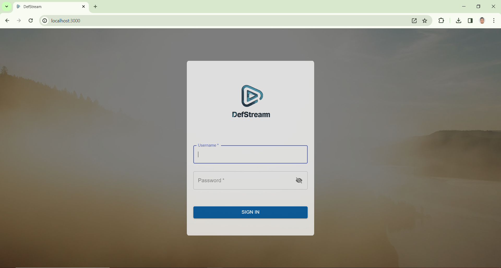
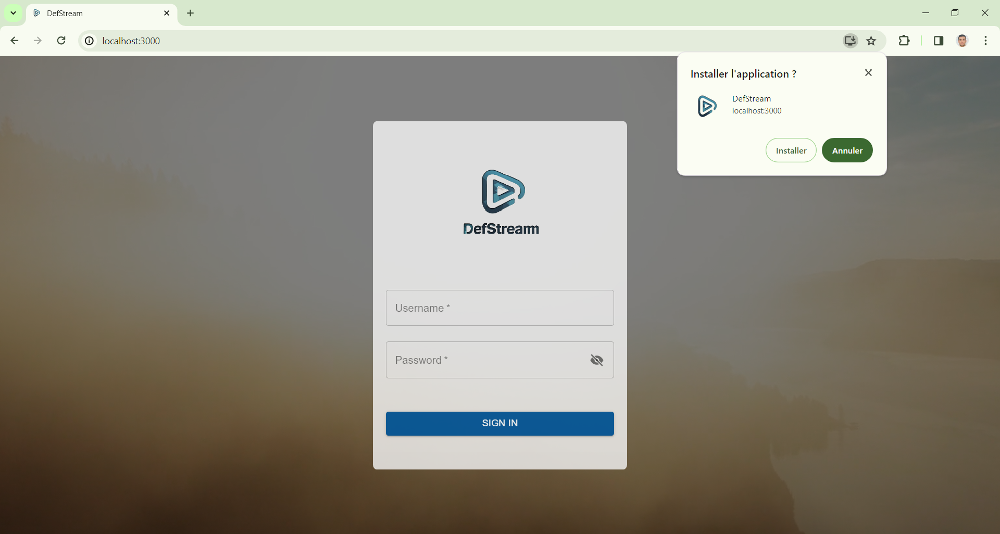

# DefStream


DefStream is a web application enabling live video streaming and real-time chat for missions, empowering users to engage with audiences during events, training sessions, or updates.

It securely streams video content and encrypts mission chats for secure storage.

## Screenshots

<div style="display: flex;">
    
    
    
    
    
    
    
    
    
    
    
    
    
    
    
    
    
    
    
    
</div>

## 🧰 Tech Stack

**Client:** React , Redux, WebRTC, WebSocket

**Server:** Node, Express, MongoDB

## 🔥 Features

- Add and modify new users.
- Add, modify and delete missions.
- Users in the same mission can chat with each other.
- Users can record the live video to an external storage device.

🚩 All chat discussions are securely encrypted.

## 📑 Prerequisits

Before cloning/forking this project, make sure you have the following tools installed:

- Git
- NodeJS 12.18.3

## 🚀 Installation

Install DefStream with npm

- Frontend side ( inside client folder )

```bash
  # Install the packages
  npm install
```

- Backend side ( inside DefStream folder )

```bash
  # Install the packages
  npm install
```

Then run both sides with:

```bash
  npm run start
```

## ⚖️ License

This project is [MIT](https://choosealicense.com/licenses/mit/) licensed.

## 💝 Support

For support, email ben.saied@proton.me and don't forget to leave a star ⭐️.

## 📝 Authors

- Github: [@bensaied](https://www.github.com/bensaied)

## 🔗 Links

[](https://www.linkedin.com/in/oussama-ben-saayeed/)
